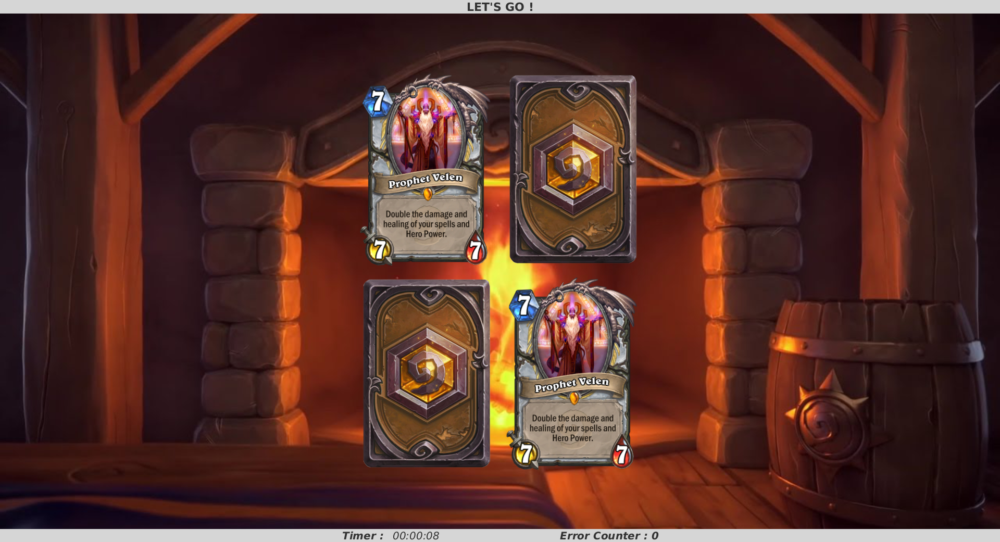
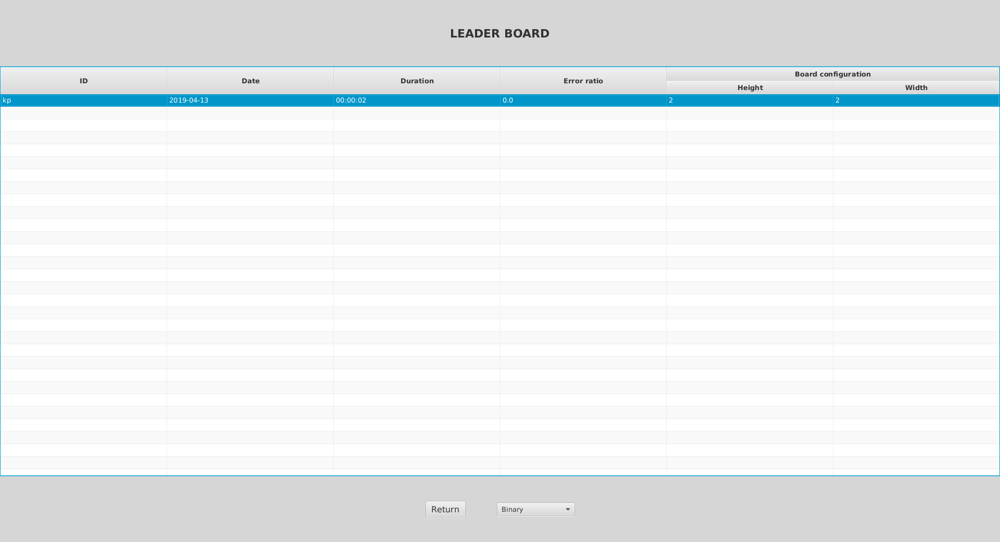

# Memory

Small memory game using JavaFX. The goal is to match cards according to their pattern.
The player can save his scores and look at other players'.
He also can choose on which visual theme he will play.

Here are some screenshots of the game:

## Developers

+ [Valentin Reversat](https://github.com/vareversat)
+ [Louis Turpinat](https://github.com/lturpinat)

